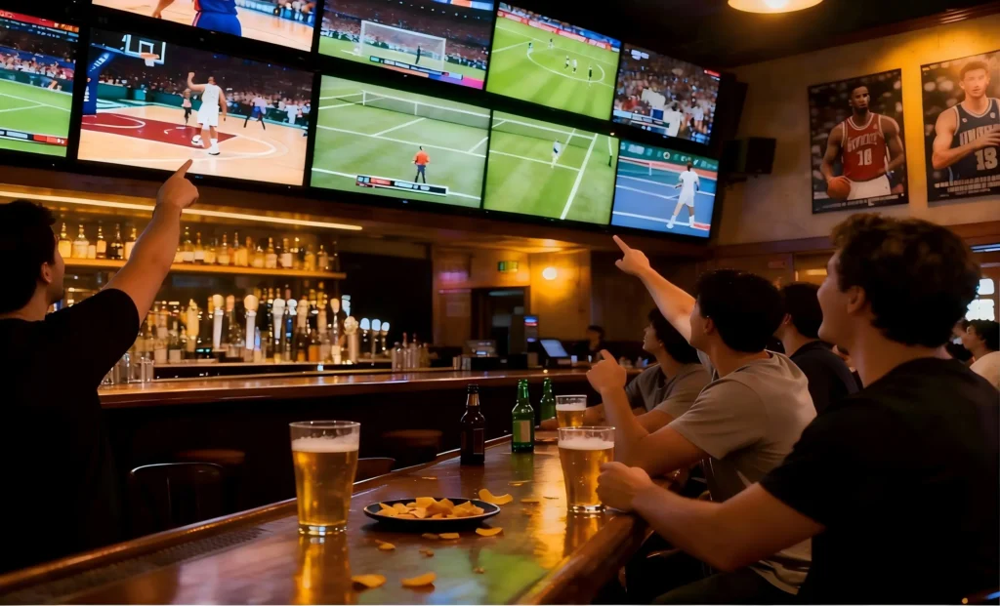
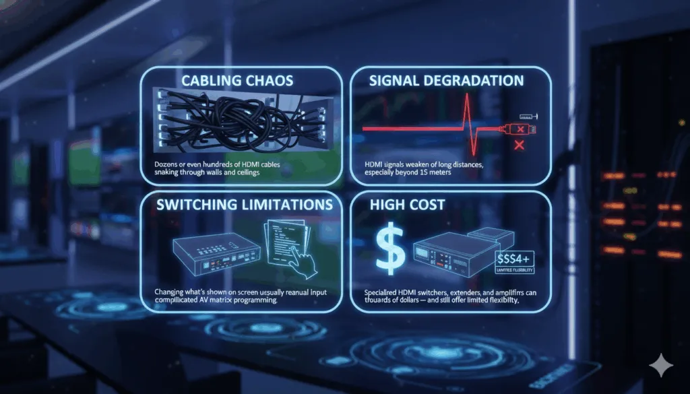
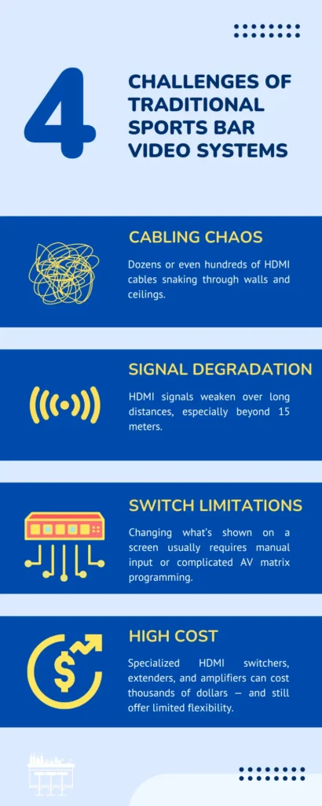
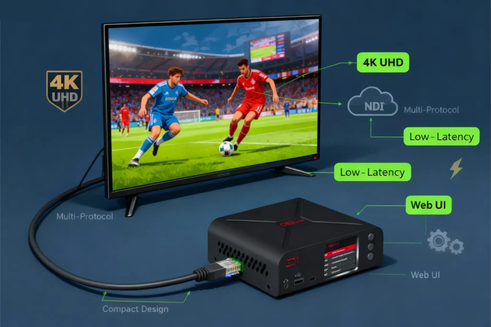

Let’s be honest — running a sports bar video system has always been a headache. In a typical setup, each TV might connect to a cable box or media player using long HDMI cables. If you want the same game on multiple screens, you’ll need an HDMI splitter. Want different games on different TVs? You’ll need multiple sources and switchers.

The more screens you add, the more complicated it gets:

- **High cost:** Specialized HDMI switchers, extenders, and amplifiers can cost thousands of dollars — and still offer limited flexibility.
- **Cabling chaos:** Dozens or even hundreds of HDMI cables snaking through walls and ceilings.
- **Signal degradation:** HDMI signals weaken over long distances, especially beyond 15 meters.
- **Switching limitations:** Changing what’s shown on a screen usually requires manual input or complicated AV matrix programming.

And when something goes wrong — like a screen showing the wrong channel or a connection dropping — troubleshooting becomes a nightmare. In short, traditional systems simply weren’t designed for the level of flexibility and control that modern sports bars need today.

In today’s sports-driven entertainment world, the experience inside a sports bar is as important as the food and drinks. Fans don’t just come to grab a beer — they come for the atmosphere, the energy, and the thrill of watching multiple live games unfold at once.

For bar owners, delivering that immersive experience means managing dozens of screens, switching between sports channels on the fly, and ensuring that every corner of the venue shows crisp, lag-free video.

Traditionally, achieving that kind of setup required a maze of HDMI cables, splitters, and expensive video switchers. It was complicated, expensive, and not always reliable.

[Image of traditional vs NDI sports bar AV setup comparison]

But in recent years, NDI (Network Device Interface) technology has quietly transformed how video can be distributed — not just in studios or production houses, but in places like sports bars, restaurants, hotels, and stadiums.

In this article, we’ll explore how NDI empowers modern sports bar video distribution — and how CNDLive’s innovative products like the D1 4K IP Video Decoder, CNDLive Manager, and C6 H.265 NDI/SRT Encoder make that transformation practical, affordable, and future-proof.

## What is NDI Technology?

NDI, short for [Network Device Interface](https://ndi.video/), is a video-over-IP technology developed to let video and audio travel across standard computer networks in real time.

Instead of needing a dedicated video cable for every screen or camera, NDI lets you send and receive broadcast-quality video over your existing Ethernet network — the same network that already connects your computers, routers, and smart TVs.

NDI’s power lies in its simplicity. It turns every connected device into both a potential video source and a receiver. You can send a live sports stream from one device and instantly display it anywhere else on the same network — all with minimal latency and no expensive video matrix hardware.

Some of NDI’s biggest advantages include:

- **Low latency**: Real-time video delivery without noticeable delay.
- **High image quality**: Up to 4K resolution with visually lossless compression.
- **Scalability**: Add more displays or sources without re-wiring.
- **Flexibility**: Works across software, hardware encoders, and displays.

For a sports bar, these advantages mean freedom: freedom from HDMI extenders, cable mess, and signal dropouts — and the ability to control dozens of screens from a single dashboard.

## The Challenge of Traditional Sports Bar Video Systems

In a typical setup, each TV might connect to a cable box or media player using long HDMI cables. The more screens you add, the more complicated it gets. Specialized HDMI switchers and amplifiers are expensive, HDMI signals degrade over 15 meters, and changing channels usually requires manual input. Traditional systems simply weren’t designed for the flexibility modern sports bars need.

## How NDI Solves These Problems

This is where NDI changes the game.

By using standard Ethernet networking, NDI eliminates the need for dedicated video cabling. Every screen, decoder, and video source just connects to the same local network — and NDI handles the rest.

**Key Benefits of NDI for Sports Bars:**

- **Simplified infrastructure**: no more HDMI distribution systems or splitters. Just plug devices into your existing LAN.
- **Dynamic video routing**: easily send different games to different screens — or mirror one source across the entire venue — with just a few clicks.
- **Scalable and flexible**: whether you have 10 TVs or 100, NDI scales effortlessly. Adding a new screen is as simple as adding another decoder.
- **High-Quality Video with Low Latency**: NDI’s compression technology ensures sharp, vibrant video up to 4K — with latency so low that it’s nearly imperceptible, even in live sports.
- **Centralized control**: using a management interface (like CNDLive Manager, which we’ll cover below), staff can easily monitor and control every display from a single computer or tablet.

For a sports bar, this means seamless game nights. No cable rewiring. No signal loss. Just instant, high-definition video across every screen.

## Typical Sports Bar Deployment Using NDI

Let’s visualize what a modern sports bar setup might look like with NDI:

[Image of NDI video distribution network topology diagram]

### Step 1: Capture the live source.

A satellite receiver, broadcast feed, or live event camera sends a video signal into an NDI encoder (for example, the CNDLive C6 H.265 NDI/SRT Encoder).

### Step 2: Distribute over the network.

The encoded NDI stream travels over your existing local network to every device connected — no special cables required.

### Step 3: Decode to screens.

Each display or projector is connected to an NDI decoder such as the CNDLive D1 4K IP Video Decoder, which converts the NDI stream back to HDMI for display.

### Step 4: Manage centrally.

Using CNDLive Manager, you can switch which feed appears on which screen — for example, playing football on half the TVs and basketball on the others — all from one control interface.

This flexible, software-defined workflow makes content routing dynamic and efficient. When a big game starts, you can instantly push it to every screen. When halftime comes, switch a few screens to music videos or commercials — all within seconds.

## How CNDLive Can Help

CNDLive has developed a complete lineup of products that make NDI deployment in sports bars simple, stable, and cost-effective. Let’s take a closer look at how each device fits into the solution.

### CNDLive D1 4K IP Video Decoder

The CNDLive D1 is a high-performance decoder designed to bring your NDI streams to life on big screens.

**What it does:**
The D1 receives NDI video streams over IP and outputs them as HDMI (or SDI) to your displays or projectors. In a sports bar setup, every screen connected to a D1 can receive any live feed available on the network.

**Why it matters:**

- Supports resolutions up to 4K UHD, ensuring crisp and vivid imagery for sports action.
- Handles a wide range of network protocols including NDI, RTSP, RTP, HTTP, and more.
- Provides smooth, low-latency playback for real-time game coverage.
- Compact design makes it easy to mount behind TVs or in AV racks.
- Built-in web interface allows simple configuration and stream selection.

In practice, the D1 turns every display into a network-connected “smart screen” capable of showing any game feed instantly — without running new cables or complicated AV gear.

### CNDLive Manager

While NDI makes distribution flexible, management software is what truly unleashes its power. CNDLive Manager is a centralized platform that lets operators monitor, switch, and control all video streams across the entire venue from one dashboard.

**Core capabilities:**

- **Real-time monitoring:** See what’s playing on each screen at any moment.
- **Instant switching:** Assign any video feed to any decoder with one click.
- **Scheduling:** Automatically change what’s displayed based on time of day or event.
- **Grouping:** Combine multiple screens into zones (e.g., “Main Hall”, “VIP Lounge”) for synchronized control.
- **User-friendly interface:** Designed for staff who may
