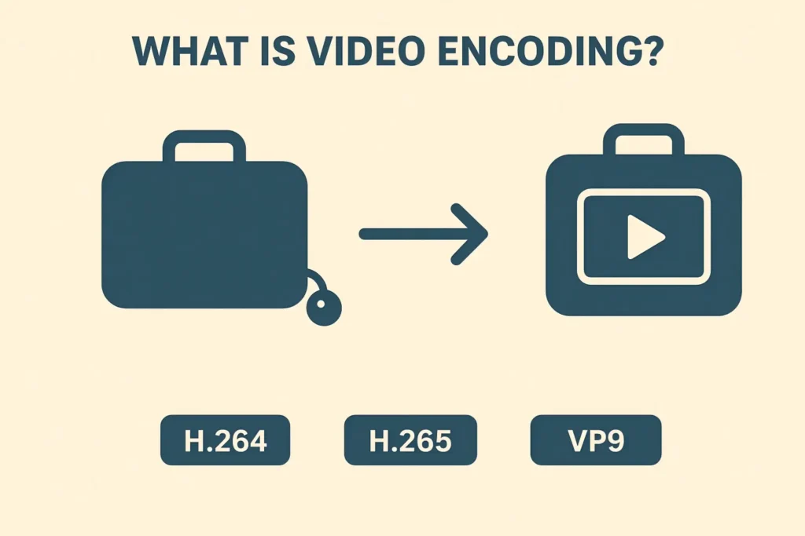
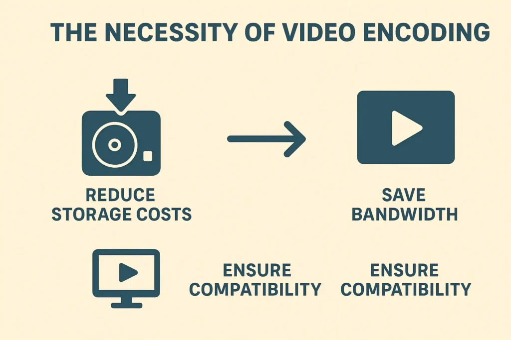
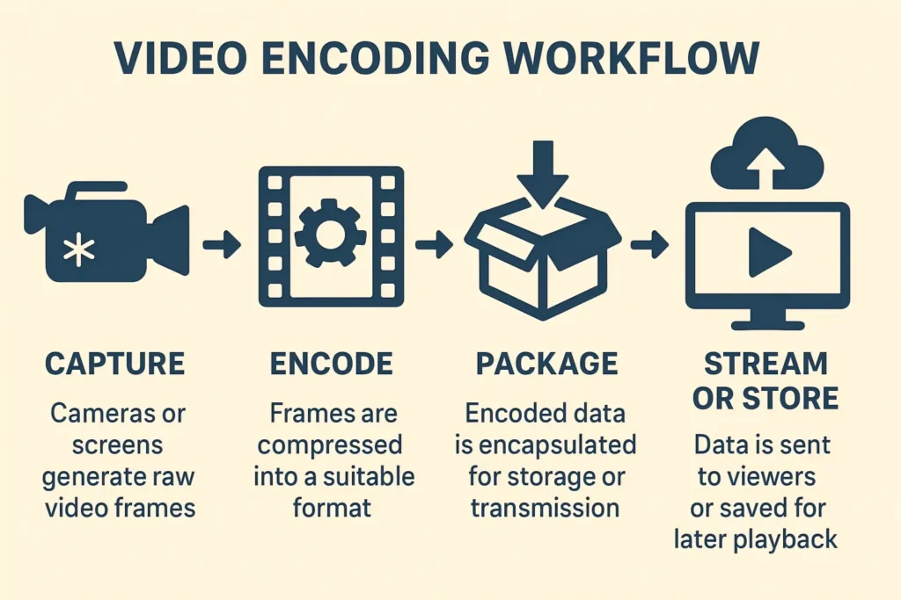

## Introduction: The Need for Video Encoding

In our daily lives, we often enjoy high-definition video calls, stream movies, or watch live events online. But have you ever wondered how such smooth, high-quality video is delivered seamlessly over the internet? The answer lies in video encoding.

<Callout type="info" title="Key Concept">
  Video encoding compresses and optimizes video data, allowing it to be
  efficiently stored and transmitted.
</Callout>

While software solutions exist, hardware video encoders offer significant advantages in performance and real-time processing. But encoding alone isn’t enough—delivering video efficiently across networks requires additional solutions like NDI.

## 1. What is Video Encoding?

Video encoding is the process of converting raw video data into a compressed format that can be stored or transmitted more efficiently.

> **The Suitcase Analogy:** Imagine packing a large suitcase: by compressing and organizing the contents, it becomes easier to carry. Similarly, video encoding reduces file size while preserving quality.

Common encoding formats include **H.264**, **H.265**, and **VP9**, each balancing compression efficiency, quality, and compatibility.

## 2. Why Video Encoding is Needed

The necessity of video encoding can be summarized in four key points. Without encoding, video would be too large to store, slow to transmit, and difficult to play on diverse devices.

<StatsGrid>
  <StatItem
    title="Reduce Storage Costs"
    value="Storage"
    description="Compressed video requires significantly less disk space."
  />
  <StatItem
    title="Save Bandwidth"
    value="Network"
    description="Smaller files allow for smoother streaming, even on limited networks."
  />
  <StatItem
    title="Real-Time Comm"
    value="Live"
    description="Essential for video calls, broadcasts, and gaming efficient transmission."
  />
  <StatItem
    title="Ensure Compatibility"
    value="Play"
    description="Encoded video can be played across various devices and platforms."
  />
</StatsGrid>

## 3. How Video Encoding Works

The video encoding workflow typically involves four distinct steps. Here is the process breakdown:

<Steps>

### Capture

**Raw Data Generation**
Cameras, sensors, or screen capture tools generate raw video frames. At this stage, the data is uncompressed and massive in size.

### Encode

**Compression Processing**
Frames are compressed into a suitable format (like H.264). Key parameters like **Resolution**, **Frame Rate**, and **Bitrate** are defined here.

### Package

**Encapsulation**
The encoded video data (and audio) is wrapped into a container format (like MP4, TS, or MOV) to ensure it can be properly stored or transmitted.

### Stream or Store

**Delivery**
The final packaged data is sent to viewers via streaming protocols (like RTMP, NDI) or saved to a disk for later playback.

</Steps>

## 4. Software vs. Hardware Encoding

Video encoding can be performed either via software or hardware. For demanding scenarios like live streaming, multi-camera production, or gaming, **hardware encoding is the preferred solution**.

<ProsCons>
  

    - **Hardware Efficiency**: Uses dedicated chips (GPU/ASIC/FPGA) with minimal
    CPU load. - **Low Latency**: Optimized for real-time delivery, crucial for
    live interaction. - **High Performance**: Handles multiple streams
    simultaneously without dropping frames.
  

  

    - **Resource Heavy**: Software runs on the CPU, consuming resources needed
    for other tasks. - **Higher Latency**: Processing time is generally slower,
    making it less ideal for live use. - **Variable Performance**: Dependent on
    overall system load and background processes.
  

</ProsCons>

## 5. Real-Time Challenges & NDI

Even with efficient encoding, real-time video transmission faces several challenges, such as latency in traditional protocols (RTMP) and synchronization issues.

<Callout type="success" title="The Solution: NDI">
  To address these issues, **NDI (Network Device Interface)** has emerged. It
  allows high-quality, low-latency video to be transmitted over local and
  wide-area networks.
</Callout>

### Case Studies: NDI Hardware Encoding

- **🎮 Game Streaming:** Hardware encoders with NDI transmit multiple feeds in real-time, ensuring smooth gameplay.
- **⚽ Sports Broadcast:** NDI transmits all streams simultaneously across the production network, enabling instant camera switching.
- **🏢 Enterprise Collaboration:** NDI combined with hardware encoding allows seamless, synchronized collaboration across devices.

## Conclusion

Video encoding is the backbone of modern video applications. As demand for high-quality, low-latency video grows, combining **Hardware Encoders** with protocols like **NDI** is the standard for the future.

<SocialContact
  title="Ready to upgrade your workflow?"
  contactText="Contact CNDLive"
  contactHref="/contact"
/>

## FAQs

<FAQ title="Q1: How do I choose between hardware and software video encoders?">
  For real-time, high-quality applications like live streaming or multi-camera
  setups, **hardware encoders** are preferred due to low latency and high
  performance.
</FAQ>

<FAQ title="Q2: How does NDI improve multi-camera live streaming?">
  NDI allows multiple camera feeds to be transmitted over a network with minimal
  delay, simplifying production and switching between angles.
</FAQ>

<FAQ title="Q3: How do I optimize video encoding for gaming or sports?">
  You should increase the bitrate, choose efficient codecs (e.g., **H.265**),
  and pair with hardware encoders to maintain quality while reducing latency to
  the absolute minimum.
</FAQ>

<FAQ title="Q4: Can I use NDI for remote collaboration in enterprise settings?">
  **Yes**, NDI enables high-definition, low-latency video sharing across
  devices, ideal for remote production, virtual meetings, or collaborative video
  editing.
</FAQ>
