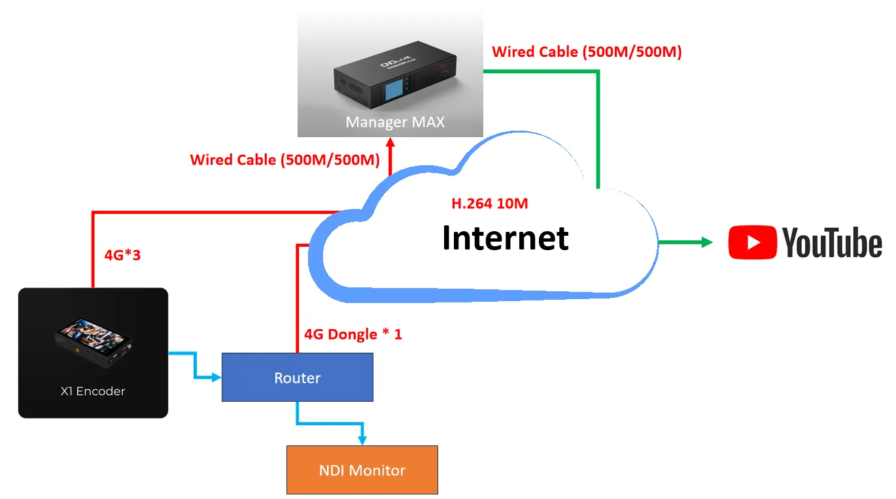
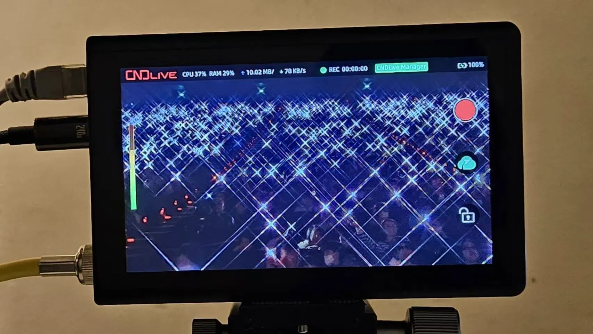
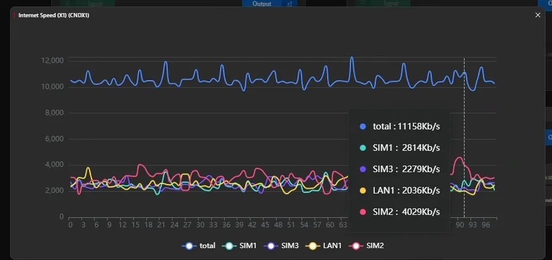

The annual Christmas Concert is fast approaching, and the client wishes to stream the event live so that everyone can join in the festive cheer. To ensure a successful live stream, stable internet service is crucial. However, challenges arise when there is no wired internet on-site and the venue is expected to be crowded with attendees. Let’s explore how we addressed these issues.

This case was hold in Taipei’s largest convention center, featuring an auditorium with a capacity of 3,300 people. The annual Christmas music concert attracted approximately 2,500 attendees this year.

#### Solution Overview

To meet the client’s requirements for a stable live stream, we deployed the CNDLive X1 4G bonding encoder, equipped with three SIM cards from different telecommunications providers. This setup ensures robust connectivity even in densely populated areas where network is not that good. For monitoring purposes, we installed a router with a 4G dongle to check status via NDI Monitor.

For ease of operation and remote management of the X1 device, we also had the CNDLive Manager Max hardware to make them a total solution. With Max, the client doesn’t need to deploy the bonding server, only an fixed IP address and port forwarding will set up. This allowed us to monitor networking conditions and remotely initiate the YouTube streaming service, ensuring smooth and efficient management.

#### Technical Setup

This is a detailed diagram illustrating the setup for reference.

#### Performance

During operation, the X1 displayed relevant data on its screen, confirming a stable transmission rate of 10 Mbps. The Manager Max GUI provided real-time visibility into each network bonding, showing that the X1 maintained a consistent 10 Mbps bandwidth throughout the event.
 

#### Conclusion

Combining the portability and ease of setup of the X1 with the comprehensive monitoring capabilities of Manager Max, our solution proved to be the ideal partner for delivering a flawless live streaming experience. Whether you’re streaming from a bustling convention center or any other challenging environment, X1 + Manager Max ensures reliable and smooth live streaming.

