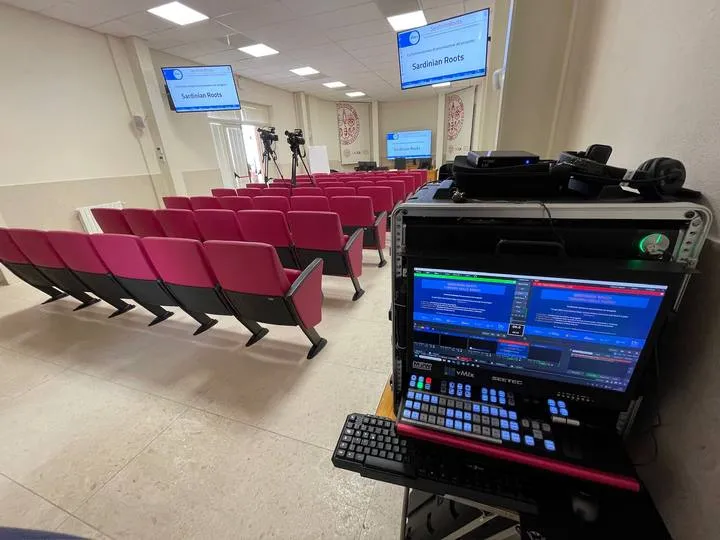
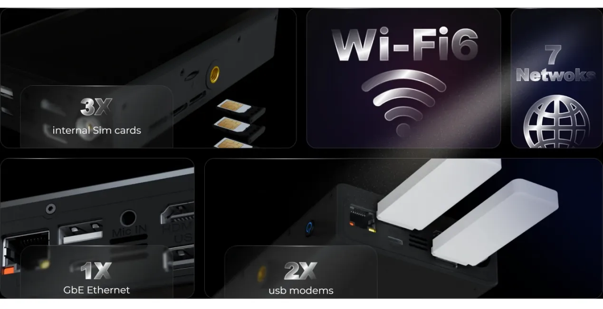
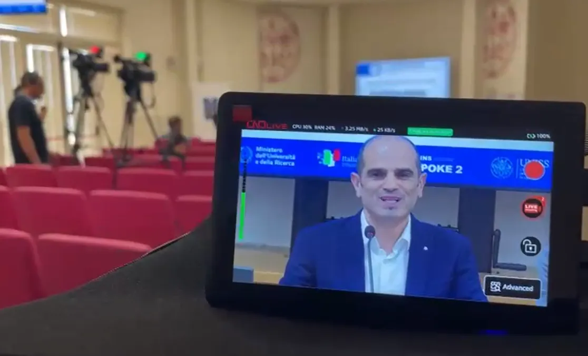

Cagliari, Italy – CNDLive is proud to highlight the reliable performance of its X1 HDMI/SDI 4G Bonding Video Encoder and Monitor, which enabled stable, high-quality live streaming during the SARDINIAN ROOTS project presentation at the University of Cagliari.
The event was part of E.INS-spoke2, an initiative within the Ecosystem of Innovation for Next Generation Sardinia (E.INS) program funded by Italy’s National Recovery and Resilience Plan. The project aims to foster collaboration between universities and local industries, strengthen community engagement, and promote innovation across Sardinia.

# Reliable Streaming in a Challenging Venue

The SARDINIAN ROOTS presentation—centered on Sardinia’s cultural heritage and the concept of “root tourism”—was held in one of the university’s historic buildings, where wired internet access was limited and mobile signals were inconsistent.

To overcome these challenges, the production team deployed the CNDLive X1 Bonding Encoder as the core of their live setup. By aggregating multiple 4G LTE SIM cards, Wi-Fi, and Ethernet connections into a single, unified data stream, the X1 ensured smooth and uninterrupted transmission throughout the entire event.

Even as network conditions changed during the broadcast, the X1’s intelligent bonding algorithm balanced bandwidth usage in real time—minimizing packet loss and latency while maintaining a stable output stream.

# The Power of Bonding

Bonding technology combines several network connections—cellular, Wi-Fi, and wired—into one resilient pipeline. For on-location streaming, this approach is crucial where single connections may fail or become overloaded.
The CNDLive X1 provides:
Uninterrupted streaming, even under unstable or congested network conditions.
Dynamic bandwidth management, automatically distributing traffic across available links.
Efficient encoding, supporting H.265/H.264 for maximum quality at minimal bitrate.
Built-in real-time monitoring with touchscreen controls, allowing operators to preview video and start/stop streaming or recording with a single click.

Complete portability, featuring an internal battery and compact design for true mobility.
These capabilities made it possible to stream the entire presentation reliably—without signal drops or video degradation—connecting local participants with remote audiences worldwide.

# Connecting Culture and Innovation

The success of the SARDINIAN ROOTS live stream demonstrates how the CNDLive X1 Bonding Encoder helps event organizers, educational institutions, and content creators deliver broadcast-quality results in any environment.

This achievement also aligns with the vision of E.INS-spoke2, showing how innovative technology can strengthen cultural exchange and make Sardinia’s stories accessible to a broader audience.
