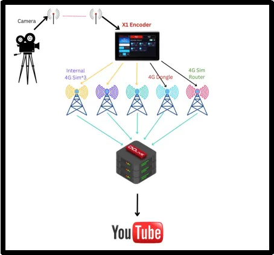
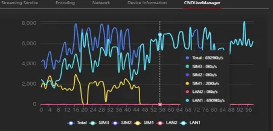
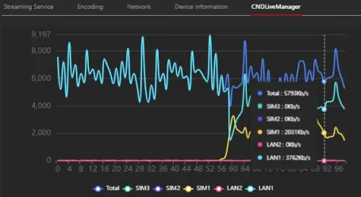
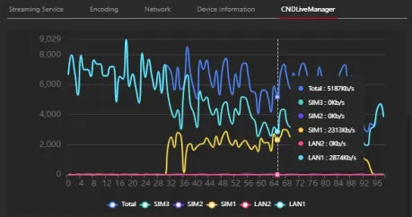

## Background:

In professional live streaming, network reliability is the cornerstone of successful event broadcasting. Viewers today expect broadcast-quality continuity—zero buffering, no signal drops, and consistent high-definition visuals. This expectation becomes critically challenging in regions with underdeveloped telecommunications infrastructure, particularly when no wired internet connection is available. Single-network dependency in such environments often leads to failed streams, dissatisfied audiences, and reputational damage for content producers. The need for a robust, multi-network streaming solution becomes not just preferable, but essential.

## Case Description:

It was a religious event in a remote village with extremely poor mobile network coverage at Vill Sargundi, Punjab, India. The venue had no wired connection, and signal strength indoors was particularly weak. The event organizers required a stable, high-quality live stream at 5000 kbps to ensure viewers could participate in the event without disruption. The pressure was substantial—this was not merely a technical delivery but a cultural and spiritual transmission that needed to maintain continuity and reverence through flawless technological execution.

## Solution Overview:

To overcome the connectivity limitations, we deployed the CNDLive X1 bonding encoder configured with multiple network sources:

- Three SIM cards from different mobile operators
- One 4G dongle
- One 4G router positioned on the rooftop for optimal signal reception

Despite being placed indoors in a low-signal environment, the X1’s intelligent bonding technology dynamically combined all available connections into a single, robust data pipeline. This multi-network approach ensured consistent bandwidth and uninterrupted streaming throughout the event.

X1 Connected with Wireless Video Receiver

Camera Connected to Wireless Transmitter

## Technical Setup

This is a detailed diagram illustrating the setup for reference.

## Performance

During operation, the X1 displayed relevant data on its screen, confirming a stable transmission rate. The CNDLive Manager GUI provides real-time visibility into each network bonding, showing that the X1 maintained a consistent bandwidth throughout the event.

## Case Advantages:

- Multi-network bonding for maximum reliability
- Big touch screen for realtime preview and operation
- High-bitrate streaming under weak signal conditions
- Simple, field-ready setup requiring minimal configuration
- Stable performance in indoor low-signal environments

## Conclusion

Thanks to the powerful bonding capabilities of the CNDLive X1, the live stream ran smoothly throughout the event, with no visible breaks or buffering for remote viewers. The setup was straightforward and efficient, allowing user to focus on production rather than troubleshooting connectivity. The CNDLive X1 continues to prove that professional-grade live streaming is possible anywhere—no matter the network challenges.

The X1's bonding technology provides customers with carrier-grade reliability in precisely the environments where it's most needed but traditionally least available. Beyond the technical achievement, this deployment enabled cultural preservation and community connection—allowing remote devotees to participate fully in a meaningful spiritual gathering they otherwise would have missed.
