> 官网内容以 Markdown 为主，新发布内容需先转为 Markdown 再交付前端。  
> 本文基于 Obsidian 操作，下载地址：[Download - Obsidian](https://obsidian.md)。

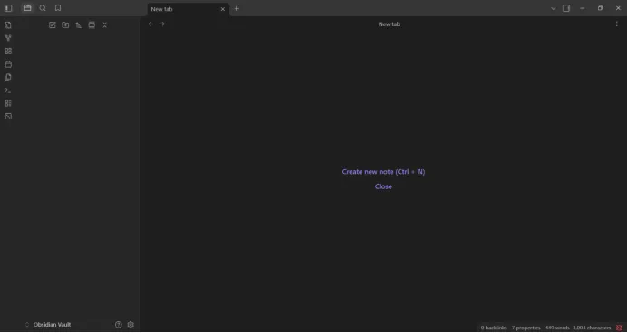

---

## 1. 安装插件：Local Images Plus

**作用**：插图时自动生成 `images` 文件夹，图片统一转 WebP，方便前端渲染。

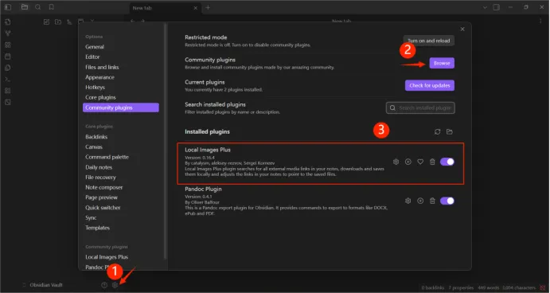

**配置步骤**

1. 启用插件后进入设置，按下图调整：
   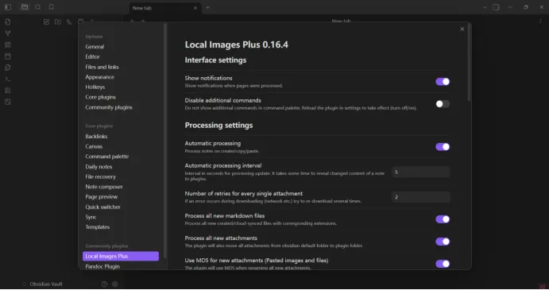
   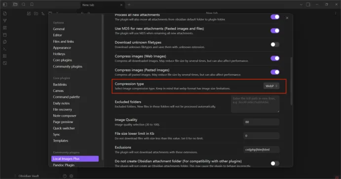

2. **Files and Links** 页签：
   - 第二点：设置为“当前文件夹的子文件夹”
   - 第三点：填 `image`  
     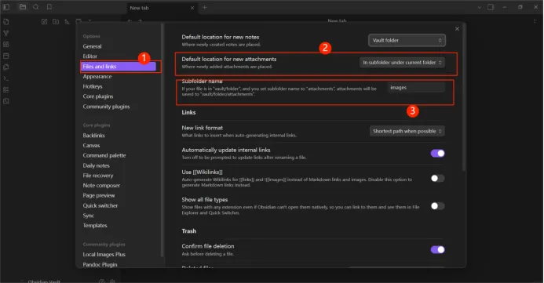

3. 页面底部勾选 **copy obsidian settings**。  
   

---

## 2. 两种使用场景

| 场景           | 目的         |
| -------------- | ------------ |
| ① 扒现有网页   | 更新已有页面 |
| ② 自行导入文章 | 发布新页面   |

> 文末附“易错点 & 注意事项”，请务必阅读。

---

# ① 扒现有网页

**环境**：Google Chrome  
**插件**：一键将网页转 Markdown 并推送到 Obsidian

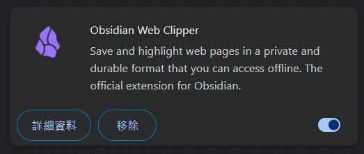

1. 打开目标文章 → 点击插件图标 → **Add to Obsidian**  
   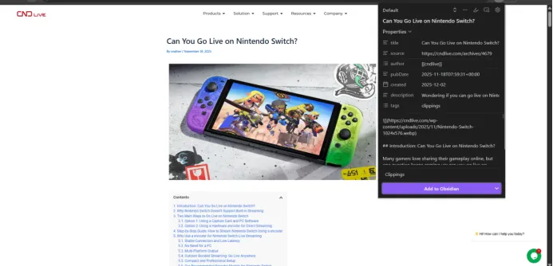

2. 内容自动同步到 Obsidian  
   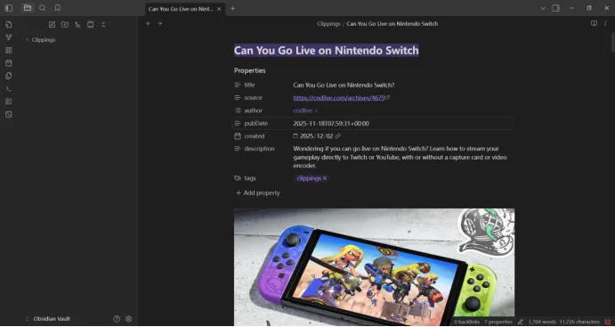

---

## 填写 Properties（必须）

| 属性          | 说明                        |
| ------------- | --------------------------- |
| `title`       | 官网显示标题                |
| `author`      | 固定 `CNDLive`              |
| `pubDate`     | 发布日期（**D 大写**）      |
| `created`     | 创建日期（可与 pubDate 同） |
| `description` | SEO 描述（可 AI 生成）      |
| `tag`         | 无空格，回车生成            |

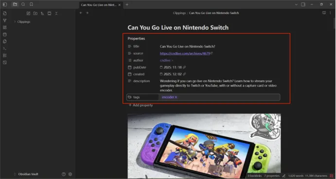

---

## 整理文件夹

1. 插件已自动生成总文件夹  
   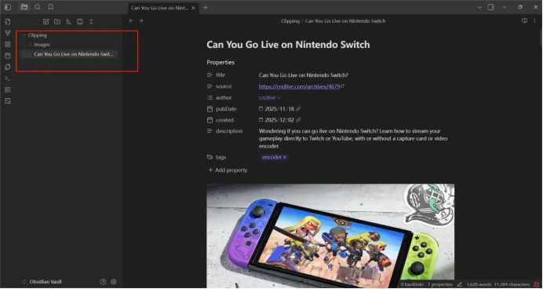

2. **有封面时**：在总文件夹内新建 `cover` 子文件夹并放入封面图  
   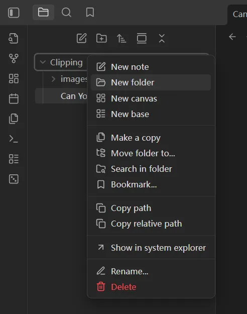

3. **重命名规则**
   - 总文件夹：`文章关键词-用横线连接`（**URL 路径，不可重复**）
   - 文章文件：`index.md`  
     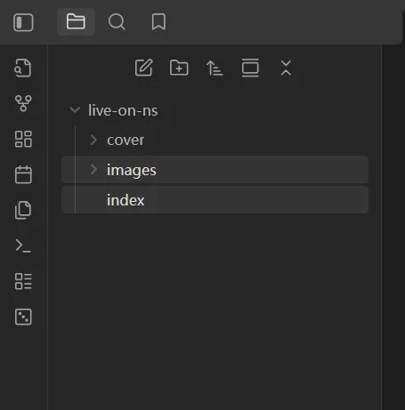

4. 检查 `images` 目录，确认图片已自动转 WebP  
   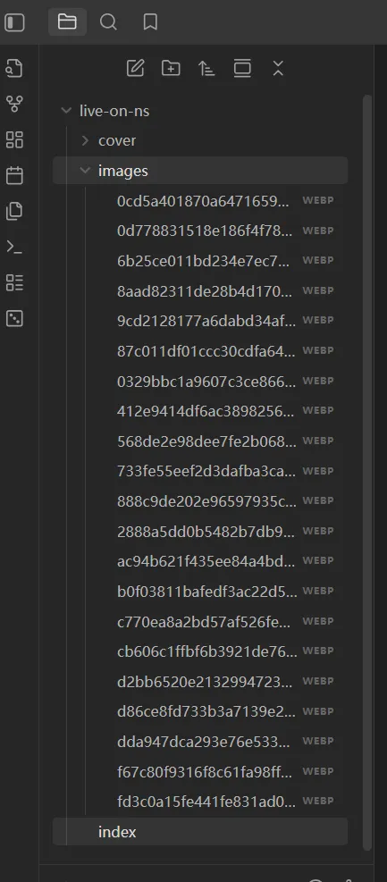

5. 交付：右键总文件夹 → **Show in system explorer** → 复制整个文件夹给前端  
   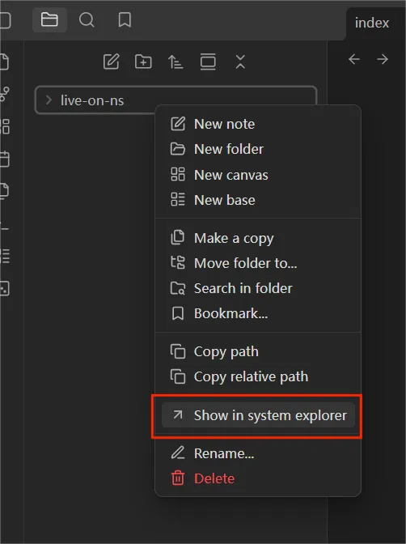

---

# ② 自行导入文章

以 Word 为例：

1. 将正文用任意工具转 Markdown 并复制代码  
   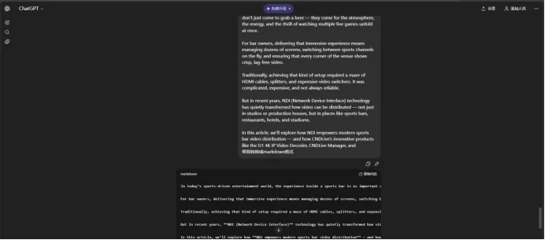

2. 在 Obsidian 新建总文件夹，内部再建：
   - `cover`（可选）
   - `images`
   - `index`（**笔记文件，非文件夹**）  
     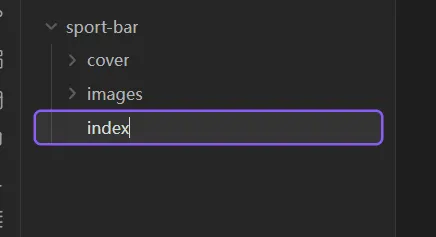

3. 在 `index` 中粘贴 Markdown → 右侧边栏添加 Properties → 按上表填写  
   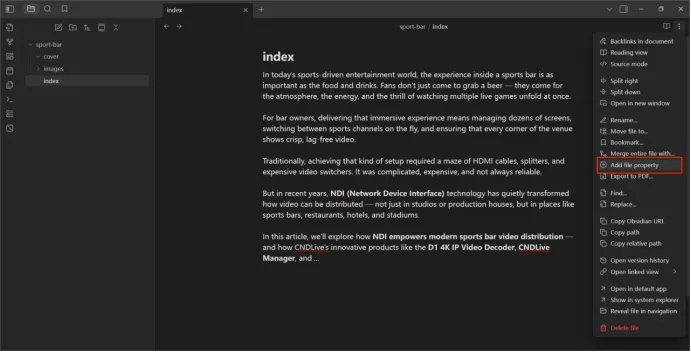

4. 插图：直接粘贴，插件自动在 `images` 生成 WebP  
   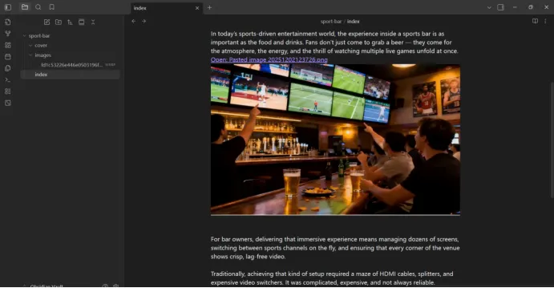

5. 同场景 ① 重命名总文件夹、检查内容后交付。

---

# 3. 易错点 & 注意事项

## ① Properties 六项必填

| 字段          | 提示                 |
| ------------- | -------------------- |
| `title`       | 官网标题             |
| `author`      | `CNDLive`            |
| `pubDate`     | 注意大小写，决定排序 |
| `created`     | 一般同 pubDate       |
| `description` | SEO 用，勿空         |
| `tag`         | 禁止空格，回车确认   |

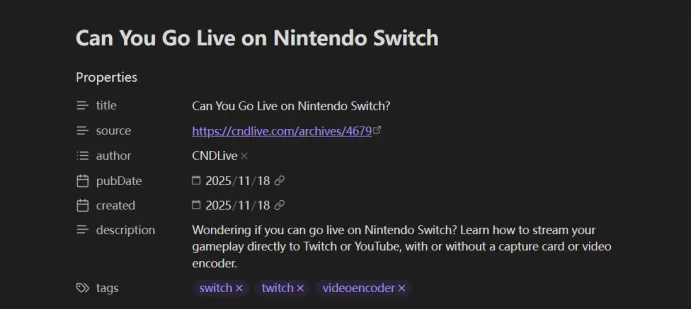

---

## ② 文件夹结构（单文单夹）
