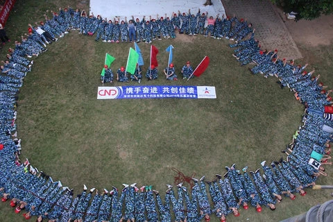
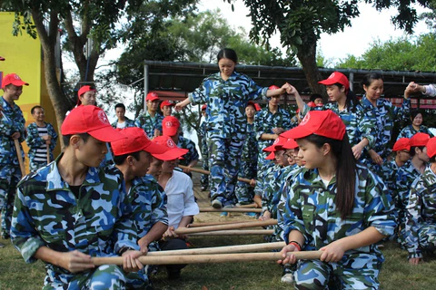

# Outward Bound Team Building Experience - Autumn 2018

## Introduction

In the autumn of 2018, our company embarked on an unforgettable **Outward Bound** experience. The goal was simple: to strengthen our teamwork, enhance communication, and tackle challenges together. Through determination, perseverance, and a lot of trial and error, we achieved something extraordinary.

## The Challenge: The Graduation Wall

One of the key highlights of the event was the **Graduation Wall**. This massive wall stood as a symbol of both personal and collective challenge. The task was to climb it—a feat that required not just physical strength but strategic thinking, trust, and team coordination.

### 800 Trials

The journey to success wasn't easy. It took **over 800 trials** before we were able to successfully complete the climb. Every member of the team participated, offering different skills, ideas, and encouragements.

Through each trial, we faced failures, but we learned from them. The key was not giving up and pushing forward, no matter how tough the obstacles seemed.

## Working as a Team

What made this challenge even more meaningful was the incredible teamwork displayed throughout the experience. Everyone played an essential role in helping each other climb the wall, whether it was offering support, finding innovative solutions, or boosting morale.

- **Communication**: We learned to listen, understand, and act on each other's cues.
    
- **Trust**: We had to trust each other fully to ensure that no one was left behind.
    
- **Problem-solving**: The wall wasn't just a physical challenge; it also required strategic thinking to figure out the best ways to approach it.
    

## Reflection: A Moment of Triumph

After many attempts, the final success was nothing short of **triumphant**. Standing at the top of the Graduation Wall, we shared a moment of pride, not only for overcoming the physical challenge but for demonstrating the strength of our unity.

This experience wasn't just about climbing a wall—it was a metaphor for the challenges we face in our daily work lives. **Through collaboration and perseverance**, there is no limit to what we can achieve together as a team.

---

## Key Takeaways

- **Teamwork is essential** for overcoming challenges.
    
- **Perseverance** leads to success, even if the journey takes longer than expected.
    
- **Trust and communication** are fundamental to achieving goals together.