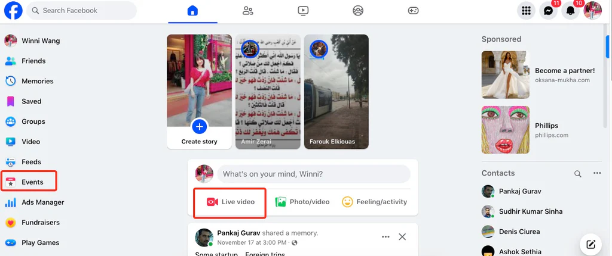
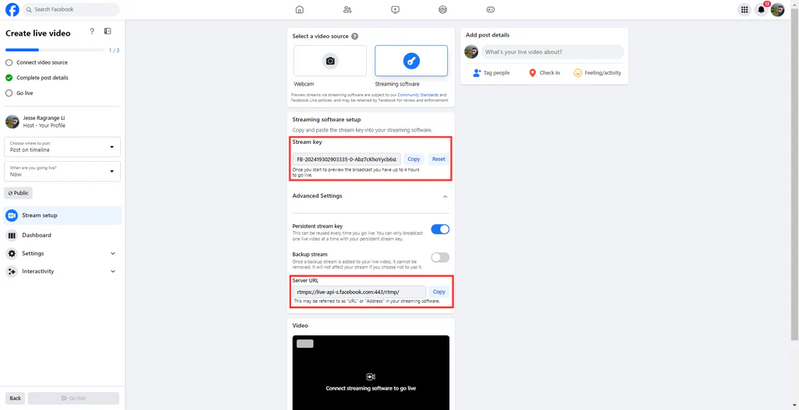

# Professional Live Event Streaming Equipment Setup Guide

With the widespread adoption of the internet, live streaming has become the mainstream way of socializing and entertainment. Compared to smartphones and capture cards, **professional streaming equipment** offers significant upgrades in image stability, audio clarity, and overall viewing experience.

Below, we use Facebook Live as an example to walk you through quickly configuring a professional streaming encoder.

---

## Step 1: Obtain Facebook Stream Key

To achieve ultra-low-latency HD streaming, first generate your stream key on Facebook.

1.  **Log in** to your Facebook account.
2.  Navigate to **"Live Video"** to create a new live event.

    

3.  Select **"Streaming Software"** as the video source.
4.  Copy the **Server URL** and **Stream Key**, then paste them—either combined or separately—into your encoder.

        > **Tip:** The full RTMP address is usually `Server URL` + `/` + `Stream Key`.

<Callout type="info" title="RTMP Address Example">

rtmps://[live-api-s.facebook.com:443/rtmp/FB-205055105973088-0-Abx4nUtWiljiWEc](https://live-api-s.facebook.com:443/rtmp/FB-205055105973088-0-Abx4nUtWiljiWEc)

</Callout>
